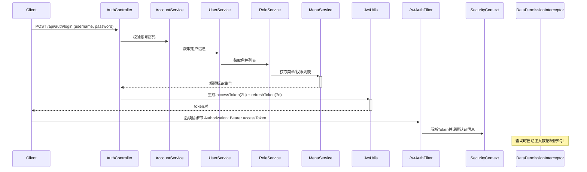

# 权限管理模块设计文档

## 概述

在现有 RAG 知识库系统中新增完整的权限管理模块，包括用户管理、账号管理、角色管理、部门管理、菜单管理、地区管理功能，并通过 Spring Security 实现认证授权和数据权限控制。

## 技术方案

- **认证**: Spring Security + JWT (accessToken 2h + refreshToken 7d)
- **数据权限**: MyBatis-Plus DataPermissionInterceptor（方案A）
- **按钮权限**: Spring Security @PreAuthorize + 前端 v-permission 指令
- **超级管理员**: sys_account.is_super_admin 字段绕过所有权限校验

## 数据库表设计

### 部门表 sys_dept
| 字段 | 类型 | 说明 |
|------|------|------|
| id | BIGINT PK | 主键 |
| name | VARCHAR(100) | 部门名称 |
| parent_id | BIGINT | 父部门ID |
| sort_order | INT | 排序 |
| status | TINYINT | 0禁用 1启用 |
| create_time/update_time | DATETIME | 时间戳 |

### 用户表 sys_user（人员信息）
| 字段 | 类型 | 说明 |
|------|------|------|
| id | BIGINT PK | 主键 |
| name | VARCHAR(100) | 姓名 |
| phone | VARCHAR(20) | 手机号 |
| email | VARCHAR(255) | 邮箱 |
| avatar | VARCHAR(500) | 头像 |
| status | TINYINT | 0禁用 1启用 |
| create_time/update_time | DATETIME | 时间戳 |

### 用户-部门关联表 sys_user_dept
| 字段 | 类型 | 说明 |
|------|------|------|
| id | BIGINT PK | 主键 |
| user_id | BIGINT | 用户ID |
| dept_id | BIGINT | 部门ID |
| is_leader | TINYINT | 是否部门负责人 0否 1是 |
| UNIQUE(user_id, dept_id) | | |

### 用户-地区关联表 sys_user_region
| 字段 | 类型 | 说明 |
|------|------|------|
| id | BIGINT PK | 主键 |
| user_id | BIGINT | 用户ID |
| region_id | BIGINT | 地区ID |
| UNIQUE(user_id, region_id) | | |

### 账号表 sys_account
| 字段 | 类型 | 说明 |
|------|------|------|
| id | BIGINT PK | 主键 |
| user_id | BIGINT | 关联用户ID |
| username | VARCHAR(100) | 登录名 UNIQUE |
| password | VARCHAR(255) | bcrypt加密密码 |
| account_type | VARCHAR(20) | 账号类型，默认PASSWORD |
| is_super_admin | TINYINT | 是否超级管理员 0否 1是 |
| status | TINYINT | 0禁用 1启用 |
| create_time/update_time | DATETIME | 时间戳 |

### 菜单表 sys_menu
| 字段 | 类型 | 说明 |
|------|------|------|
| id | BIGINT PK | 主键 |
| name | VARCHAR(100) | 菜单名称 |
| parent_id | BIGINT | 父菜单ID |
| type | TINYINT | 0目录 1菜单 2按钮 |
| permission | VARCHAR(200) | 权限标识如 system:user:list |
| path | VARCHAR(255) | 路由路径 |
| component | VARCHAR(255) | 组件路径 |
| icon | VARCHAR(100) | 图标 |
| sort_order | INT | 排序 |
| status | TINYINT | 状态 |
| create_time/update_time | DATETIME | 时间戳 |

### 角色表 sys_role
| 字段 | 类型 | 说明 |
|------|------|------|
| id | BIGINT PK | 主键 |
| name | VARCHAR(100) | 角色名称 |
| code | VARCHAR(100) | 角色编码 UNIQUE |
| dept_data_scope | TINYINT | 部门数据权限: 1全部 2自定义 3本部门及下属 4本部门 5本人 |
| region_data_scope | TINYINT | 地区数据权限: 1全部 2自定义 3本用户所属地区 |
| status | TINYINT | 状态 |
| create_time/update_time | DATETIME | 时间戳 |

### 角色-菜单关联表 sys_role_menu
| 字段 | 类型 | 说明 |
|------|------|------|
| id | BIGINT PK | 主键 |
| role_id | BIGINT | 角色ID |
| menu_id | BIGINT | 菜单ID |
| UNIQUE(role_id, menu_id) | | |

### 角色-部门关联表 sys_role_dept（用于自定义部门数据权限）
| 字段 | 类型 | 说明 |
|------|------|------|
| id | BIGINT PK | 主键 |
| role_id | BIGINT | 角色ID |
| dept_id | BIGINT | 部门ID |
| UNIQUE(role_id, dept_id) | | |

### 角色-地区关联表 sys_role_region（用于自定义地区数据权限）
| 字段 | 类型 | 说明 |
|------|------|------|
| id | BIGINT PK | 主键 |
| role_id | BIGINT | 角色ID |
| region_id | BIGINT | 地区ID |
| UNIQUE(role_id, region_id) | | |

### 用户-角色关联表 sys_user_role
| 字段 | 类型 | 说明 |
|------|------|------|
| id | BIGINT PK | 主键 |
| user_id | BIGINT | 用户ID |
| role_id | BIGINT | 角色ID |
| UNIQUE(user_id, role_id) | | |

### 地区表 sys_region
| 字段 | 类型 | 说明 |
|------|------|------|
| id | BIGINT PK | 主键 |
| name | VARCHAR(100) | 地区名称 |
| code | VARCHAR(50) | 地区编码 |
| create_time/update_time | DATETIME | 时间戳 |

## 数据权限设计

### 部门数据权限范围 (dept_data_scope)

| 值 | 说明 | SQL 过滤条件 |
|----|------|-------------|
| 1 | 全部数据 | 不追加 |
| 2 | 自定义部门 | dept_id IN (sys_role_dept) |
| 3 | 本部门及下属 | dept_id IN (用户所属部门 + 递归子部门) |
| 4 | 本部门 | dept_id IN (用户所属部门) |
| 5 | 本人 | create_by = 当前用户名 |

### 地区数据权限范围 (region_data_scope)

| 值 | 说明 | SQL 过滤条件 |
|----|------|-------------|
| 1 | 全部数据 | 不追加 |
| 2 | 自定义地区 | region_id IN (sys_role_region) |
| 3 | 本用户所属地区 | region_id IN (sys_user_region) |

### 用户多角色合并规则

- 菜单/按钮权限 = 所有角色权限的并集
- 数据权限范围 = 取范围最大的（如：角色A为"全部"则最终为"全部"；否则取最小范围的）
- 自定义部门/地区列表 = 所有角色配置的并集

### 超级管理员

- `sys_account.is_super_admin = 1` 时绕过所有权限校验
- 拥有所有菜单/按钮权限
- 数据权限无限（可看所有数据）
- 启动时自动初始化超级管理员账号

## 认证流程



## 前端页面

| 路由 | 页面 | 功能 |
|------|------|------|
| /login | 登录页 | 独立登录页面 |
| /system/user | 用户管理 | 用户CRUD，关联账号/角色/部门/地区 |
| /system/account | 账号管理 | 账号CRUD，绑定用户 |
| /system/role | 角色管理 | 角色CRUD，关联菜单，配置数据权限 |
| /system/dept | 部门管理 | 部门树CRUD |
| /system/menu | 菜单管理 | 菜单树CRUD |
| /system/region | 地区管理 | 地区CRUD |

### 按钮权限控制

前端通过自定义指令 `v-permission="'system:user:add'"` 控制按钮显示/隐藏。

## 知识库集成

### knowledge_document 表新增字段

```sql
ALTER TABLE knowledge_document ADD COLUMN dept_id BIGINT COMMENT '所属部门ID';
ALTER TABLE knowledge_document ADD COLUMN region_id BIGINT COMMENT '所属地区ID';
ALTER TABLE knowledge_document ADD COLUMN create_by VARCHAR(100) COMMENT '创建人';
```

### 上传流程变更

文档上传时，前端增加部门和地区选择器 → 后端保存到文档表 → 查询时数据权限拦截器自动过滤。

### 查询过滤

文档/切片等资源的查询，通过 MyBatis-Plus DataPermissionInterceptor 自动追加：
```sql
WHERE dept_id IN (允许的部门列表) AND region_id IN (允许的地区列表)
```

## 包结构

```
knowledge-core/src/main/java/com/knowledge/
├── auth/
│   ├── entity/         SysUser, SysAccount, SysRole, SysDept, SysMenu, SysRegion
│   ├── enums/          DataScopeEnum, MenuTypeEnum
│   └── mapper/         SysUserMapper, SysAccountMapper, SysRoleMapper, etc.
├── common/
│   ├── annotations/    @DataPermission
│   └── handler/        DataPermissionInterceptor

knowledge-service/src/main/java/com/knowledge/
├── auth/
│   ├── service/        SysUserService, SysAccountService, SysRoleService, etc.
│   ├── security/       UserDetailsServiceImpl, JwtUtils, TokenPair
│   └── permission/     DataScopeSqlBuilder, DeptDataProvider, RegionDataProvider

knowledge-api/src/main/java/com/knowledge/
├── auth/
│   ├── controller/     AuthController, SysUserController, SysRoleController, etc.
│   ├── dto/            LoginRequest, LoginResponse, TokenRefreshRequest, etc.
│   └── security/       SecurityConfig, JwtAuthFilter, PermissionEvaluator

knowledge-ui/src/
├── views/
│   ├── login/          LoginView.vue
│   └── system/         UserView.vue, AccountView.vue, RoleView.vue, DeptView.vue, MenuView.vue, RegionView.vue
├── api/                auth.js, user.js, account.js, role.js, dept.js, menu.js, region.js
├── router/             index.js (新增路由)
├── stores/             auth.js (Pinia 认证状态管理)
├── directives/         permission.js (v-permission指令)
└── components/         DeptTree.vue, MenuTree.vue
```
